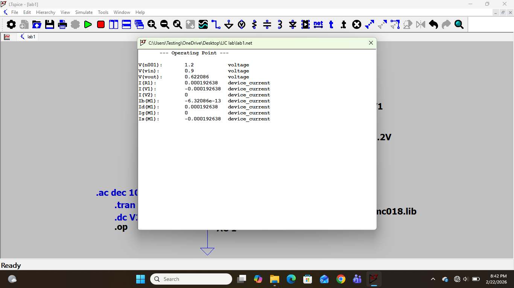
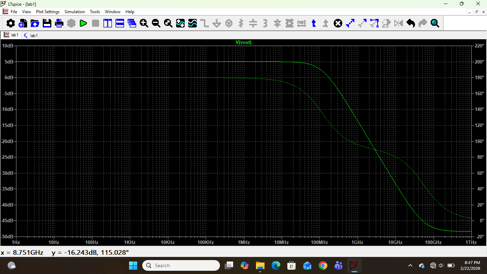

# Experiment 1: Common Source (CS) Amplifier

## Aim
To design and analyze a Common Source (CS) amplifier using tsmc018 technology with:
- Power Budget = 0.5mW
- VDD = 1.5V
- Load Capacitance = 1pF

---

## Theory

The MOSFET acts as an amplifier when biased in saturation region:

V_DS ≥ V_OV

The CS amplifier provides:
- High voltage gain
- High input impedance
- 180° phase shift

---

## Design Calculations

### Power Equation
P = VDD × ID

ID = 0.5mW / 1.5V  
ID = 333µA

### Transconductance
gm = 2ID / VOV  
gm = 3.33mS (assuming VOV = 0.2V)

### Drain Resistor
RD = 2.25kΩ

### Gain
Av = -gmRD  
Av ≈ -7.5 V/V

---

## Circuit Diagram

---

## DC Operating Point

---

## AC Analysis

---

## Conclusion
The CS amplifier was successfully designed under 0.5mW power constraint with gain ≈ -7.5 V/V.
